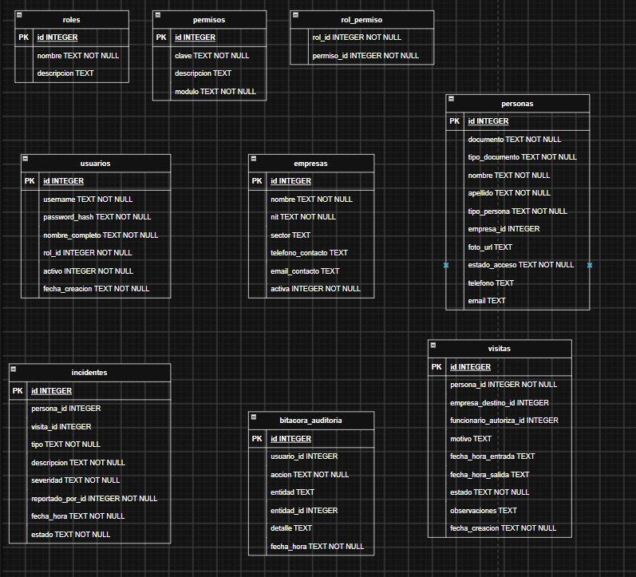
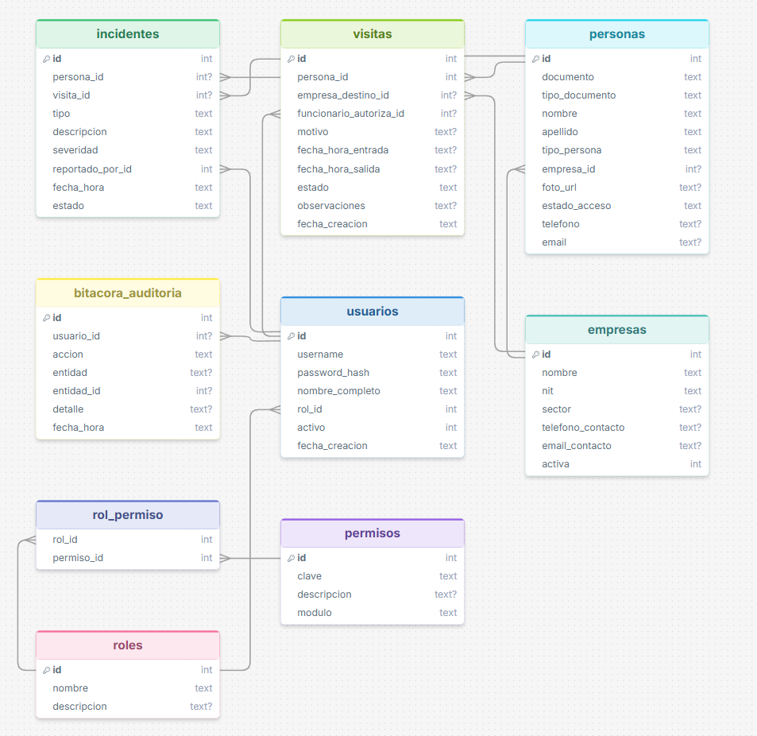
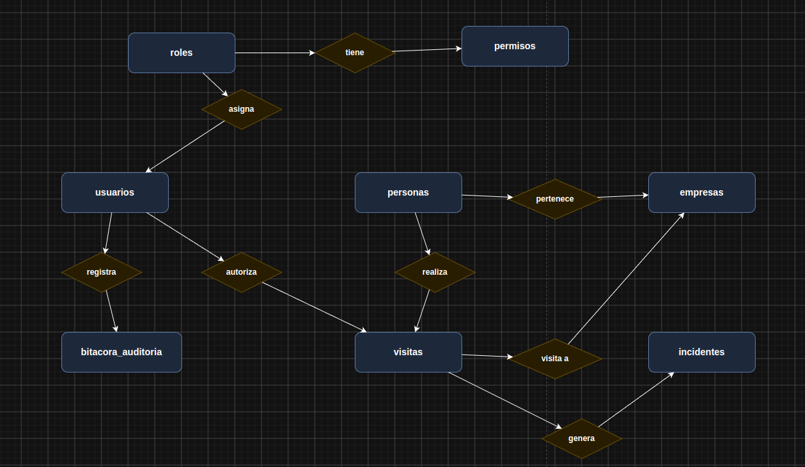

<div align="center">

# 🏢 SICA — Sistema Integrado de Control de Acceso
### Zona Acme · Complejo Empresarial


*Aplicación de escritorio nativa para gestionar y auditar de forma segura el acceso de trabajadores y visitantes al complejo.*

</div>

---

## 🎯 ¿Qué es SICA?

**SICA** permite gestionar de manera integral la seguridad y los ingresos a **Zona Acme**. 
El sistema conecta a los **Funcionarios** (quienes pre-registran visitantes), los **Guardas de Seguridad** (quienes validan los ingresos y salidas) y los **Administradores** mediante un control de acceso centralizado, roles estrictos y auditoría inmutable. Todo esto construido bajo **Arquitectura Hexagonal**.

## ✨ Funciones Clave

- 👥 **Gestión Completa:** Crea y administra visitantes, trabajadores y empresas.
- 🚪 **Check-In / Check-Out:** Control rápido en portería por parte de los guardas.
- 📋 **Pre-registro de Visitas:** Funcionarios autorizan ingresos anticipadamente.
- 🛡️ **Seguridad (RBAC):** Permisos específicos dependiendo de tu rol.
- ⚠️ **Incidentes:** Registro de novedades y reportes centralizados.

---

## 🚀 Cómo Ejecutar el Proyecto

No necesitas instalar bases de datos externas; el proyecto usa SQLite integrado. 

### Opción 1: Desde tu IDE (Recomendado)
1. Abre el proyecto en IntelliJ IDEA, VS Code o Eclipse.
2. Espera a que Maven descargue las dependencias.
3. Ejecuta la clase principal: `src/main/java/com/acme/sica/SicaApplication.java`

### Opción 2: Desde la Terminal
```bash
# Compilar el código
mvn clean compile

# Iniciar la aplicación
mvn exec:java
```

---

## 🔑 Cuentas de Prueba

La base de datos se inicializa automáticamente con información de prueba en el primer arranque. 

Usa estas credenciales para probar los distintos flujos:

| Rol | Usuario | Contraseña | ¿Qué puede hacer? |
|-----|---------|------------|-------------------|
| 🔴 **Admin** | `admin` | `admin123` | Acceso total al sistema y configuraciones. |
| 🟡 **Guarda** | `guarda1` | `guarda123` | Registra entradas (Check-In) y salidas (Check-Out). |
| 🟢 **Funcionario** | `funcionario1` | `func123` | Pre-registra y aprueba visitas para su empresa. |

---

## 🗄️ Modelo y Arquitectura de la Base de Datos

El sistema SICA implementa una base de datos relacional altamente estructurada (usando SQLite embebido) que cumple con la tercera forma normal (3FN) para garantizar la integridad referencial y evitar la redundancia de datos.

### ¿Cómo funciona la base de datos?
La base de datos funciona a través de 3 pilares clave fuertemente interconectados:

1. **Gestión de Entidades y Control de Acceso Físico (Core del Negocio):**
   Las `empresas` son las organizaciones dentro del complejo. Cada empresa tiene una o más `personas` asociadas (trabajadores). Las `visitas` conectan a un visitante (persona externa) con su anfitrión (funcionario). Cada visita cambia de estados (PENDIENTE, APROBADO, DENTRO, CERRADA) controlados estrictamente desde el código Java. También, ante cualquier eventualidad, se registran `incidentes` atados tanto a personas como a visitas específicas.
2. **Seguridad y Control de Acceso Lógico (RBAC):**
   Se basa en el modelo *Role-Based Access Control*. Los `usuarios` del sistema no tienen permisos directos, sino que tienen un `rol` asignado (Ej: "Admin", "Guarda"). Los permisos específicos están en la tabla `permisos` ("hacer_check_in", "ver_reportes"). La tabla intermedia `rol_permiso` define dinámicamente qué puede hacer cada rol.
3. **Auditoría Estricta e Inmutable:**
   La tabla `bitacora_auditoria` funciona como una caja negra. Cada acción importante que los usuarios realizan en el sistema se registra aquí de forma automatizada (Inicios de sesión, check-ins, aprobaciones), apuntando qué usuario lo hizo y en qué fecha/hora exacta.

### Diagramas de Normalización

A continuación, se presentan los esquemas visuales que definen nuestra estructura:

#### 1. Modelo Relacional (Esquema de Tablas - DrawSQL)
Este diagrama muestra las tablas normalizadas con sus claves primarias (PK) y foráneas (FK), definiendo exactamente las restricciones técnicas.



#### 2. Modelo Entidad-Relación (Notación Chen/Rombos - Draw.io)
Este diagrama ilustra conceptualmente cómo se relacionan las entidades de negocio utilizando la notación clásica para facilitar su entendimiento.



#### 3. Diagrama Entidad-Relación con Notación Chen (Rombos)

Este diagrama representa las entidades del sistema y sus relaciones usando la notación Chen, donde los **rectángulos** son entidades y los **rombos** son las relaciones entre ellas.



## Decisiones de Diseño y Arquitectura

El requerimiento original planteaba el uso de una arquitectura MVC (Model-View-Controller). Sin embargo, con el objetivo de presentar una solución de grado profesional, el SICA fue desarrollado siguiendo **Arquitectura Hexagonal (Ports and Adapters)**. Esta decisión arquitectónica es una evolución moderna del MVC tradicional que aísla completamente la lógica de negocio (Dominio) de las interfaces de usuario (Swing) y de las bases de datos (SQLite), lo cual garantiza un código mucho más robusto, testeable y alineado a los principios SOLID:

- **Single Responsibility Principle (SRP):** Cada clase tiene una responsabilidad única. Por ejemplo, `AutorizacionService` maneja solo validación de roles, mientras `ControlAccesoService` orquesta la lógica de negocio.
- **Dependency Inversion Principle (DIP):** Los servicios de aplicación dependen de abstracciones (interfaces como `VisitaRepository`) y no de detalles de implementación de base de datos.

### 5 Patrones de Diseño Implementados

Para resolver los distintos retos técnicos del proyecto, se aplicaron rigurosamente los siguientes 5 patrones de diseño:

1. **Patrón Strategy:** Se utilizó la interfaz `EstrategiaAcceso` para desacoplar las complejas reglas de negocio de los distintos flujos de ingreso (Invitado No Anunciado, Pase Temporal, Salida Olvidada). Esto permite extender las reglas en el futuro sin modificar el `ControlAccesoService` (cumpliendo el Open/Closed Principle).
2. **Patrón Singleton:** Implementado en `DatabaseConnection.getInstance()` para garantizar una única instancia global de la conexión a la base de datos (SQLite) durante todo el ciclo de vida de la aplicación de escritorio.
3. **Patrón Repository (DAO):** Aisla la capa de dominio de la persistencia de datos. Interfaces como `VisitaRepository` dictan el contrato, mientras que `VisitaRepositoryImpl` se encarga de la lógica SQL específica, permitiendo un fácil intercambio de bases de datos.
4. **Dependency Injection (Inyección de Dependencias):** Se evitó instanciar dependencias fuertemente acopladas dentro de los servicios. En su lugar, todos los repositorios y servicios transversales (como `AuditoriaService`) se inyectan a través de los constructores (ej. en `MainFrame.java`).
5. **Patrón Observer (Event-Driven):** La aplicación implementa un sistema asíncrono de eventos a través de `NotificacionService` (Publisher) y `AccesoEvent`. Esto permite que la interfaz gráfica y otros módulos reaccionen a los cambios de estado (como un check-in) en tiempo real, sin estar fuertemente acoplados.

---

<div align="center">
Desarrollado con ☕ Java · Arquitectura Hexagonal · SOLID Principles
</div>
